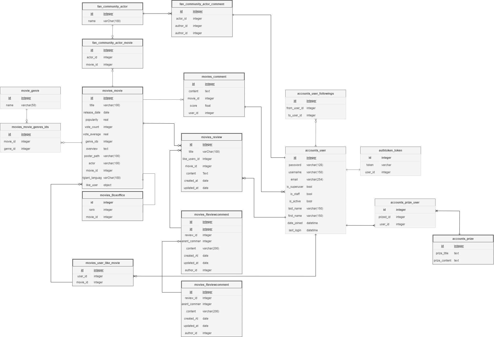
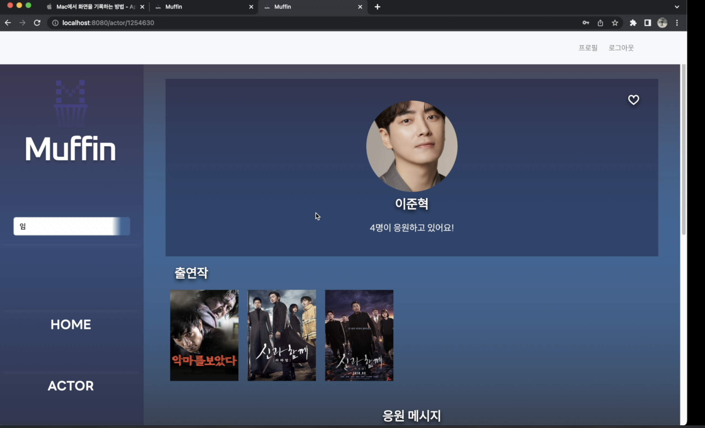
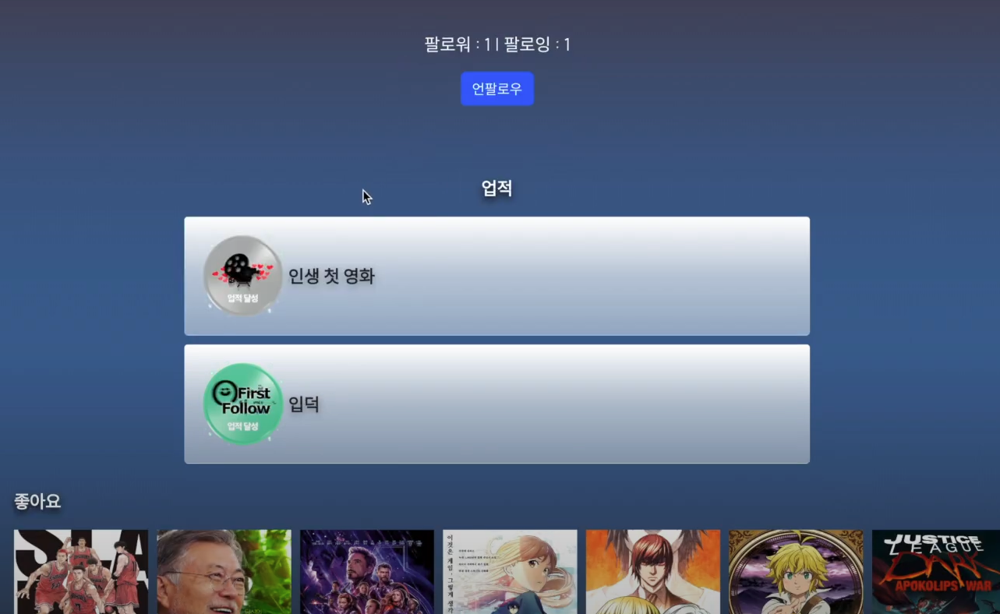

# 🎬9기 2반 9조 관통프로젝트


# Index

1. **팀원 정보 및 업무 분담 내역**

2. **목표 서비스 구현 및 실제 구현 정도**

3. **데이터베이스 모델링 (ERD)**

4. **영화 추천 알고리즘에 대한 기술적 설명**

5. **서비스 대표 기능에 대한 설명**

6. **배포 서버 URL (배포했을 경우)**

7. **기타 (느낀 점, 후기 등)**

---

# 1. 팀원 정보 및 업무 분담 내역

| **역할** | 이름   | 업무 분담   |
| -------- | ------ | ----------- |
| 조장     | 김지훈 | 프론트 전반 |
| 팀원     | 박민아 | 백엔드 전반 |

---

# 2. 목표 서비스 구현 및 실제 구현 정도

### 목표 서비스

- **App**

  - 로그인/ 아웃/ 검색 기능

- **MOVIES**

  - 영화 추천 알고리즘

  - 영화 상세 페이지 / 영화 예고편 재생

  - 영화 관련 커뮤니티

- **ACTORS**

  - 배우 커뮤니티

  - 배우 팔로우 및 배우 인증 기능

- **ACCOUNTS**

  - 팔로우 기능/ 플레이 리스트 기능 ( 좋아요와 유사하게 구현 )

### 구현한 기능

- **APP** **(90 %)**

  - 로그인/ 로그아웃

  - 영화 및 배우 검색

  -

- **MOVIES** **(90 %)**

  - 영화 추천 알고리즘
  - 영화 상세 페이지 / 영화 예고편 재생
  - 영화 관련 게시판
  - 한줄평, 별점\*\*\*\*

- **ACTORS (80 %)**

  - 배우별 한줄 응원
  - 배우 팔로우

- **ACCOUNTS (90 %)**

  - 유저 간 팔로우
  - 좋아요 기록
  - 업적 기능

---

# 3. 데이터베이스 모델링 (ERD)



---

# 4. 영화 추천 알고리즘에 대한 기술적 설명

#### 1. 좋아요 기반 사용자 간 유사도 분석

- 좋아요한 영화가 많이 겹치는 사람은 같은 취향일 것으로 판단

#### 2. 사용자 좋아요 기반 장르별 추천

- 내가 좋아하는 영화의 장르 개수를 세고 가장 선호하는 장르 뽑아내기

```
import json
import numpy as np
import pandas as pd
import matplotlib.pyplot as plt
import seaborn as sns
from collections import Counter

def recommend(data):
    me = data['me']
    df_me = pd.DataFrame([list(me.values())], columns=me.keys())
    others = data['others']
    movies = data['movies']

    df_others = pd.DataFrame(others)
    df_movies = pd.DataFrame(movies)
    # 보기 쉽게 하기 위해 전처리
    df_me.drop(df_me.columns[[0,1,3,4,5]], axis=1, inplace=True)
    df_others.drop(df_others.columns[[0,1,3,4,5]], axis=1, inplace=True)
    df_movies.drop(df_movies.columns[[1,2,3,5,7,8,9]], axis=1, inplace=True)

    # 나의 좋아요 정보 추출.
    like_movies_ids = df_me['like_movies'].values[0]  # like_movies 열의 값을 가져옴
    genre_counts = Counter()
    # 내가 좋아요한 영화들의 장르 개수    
    for movie_id in like_movies_ids:
        genres = df_movies.loc[df_movies['id'] == movie_id, 'genre_ids'].values[0]
        genre_counts.update(genres)

    #
    genres = list(genre_counts.keys())
    counts = list(genre_counts.values())

    # 다른 사람들의 좋아요 가져오기   
    others_like_list = {}
    print(df_others)
    for index, row in df_others.iterrows():
        user_name = row['username']
        others_like_movies = row['like_movies']
        others_like_list[user_name] = others_like_movies

    # 나의 좋아요와 비교해서 같은 영화를 좋아하는가    
    score = {}
    for othername, movies in others_like_list.items():
        score[othername] = 0
        for movie in movies:
            if movie in like_movies_ids:
                score[othername] += 1

    # 겹치는 영화가 많을 수록 점수가 높다. top5 뽑아내            
    score_items = sorted(score.items(), key=lambda x: x[1], reverse=True)
    top5 = score_items[:5]

    recommend_list = []
    for name, rate in top3:
        print(name)
        movies = df_others.loc[df_others['username']==name, 'like_movies'].values[0]
        recommend_list.extend(movies)
    # top5가 좋아하는 영화 중 내가 보지 않은 영화 불러오기
    recommend_list = set(recommend_list)
    like_movies_ids = set(like_movies_ids)
    recommend_list = list(recommend_list-like_movies_ids)


    # plt.bar(range(len(genres)), counts, align='center')
    # plt.xticks(range(len(genres)), genres)
    # plt.xlabel('Genre')
    # plt.ylabel('Count')
    # plt.title('Genre Counts')

    # 그래프 출력
    # plt.show()
    # 내가 보지 않은 영화와 내가 좋아하는 장르의 개수를 반환한.
    return recommend_list, genre_counts


```

ex ) 사용자가 선호하는 장르


---

# 5 . 서비스 대표 기능에 대한 설명

## **🔗** 홈 화면 - 박스 오피스 Top 10 과 추천 알고리즘


## 🔗 영화 상세 페이지 - 영상/ 좋아요/ 출연진/ 별점 및 한 줄 감상평/ 영화별 게시판


## 🔗 배우 화면 - 팬 수 대로 출력


## 🔗 배우 프로필 - ㅂㅂ/ 출연작/ 응원 메시지 작성



## 🔗 프로필 화면



## 🔗 업적 기능 - 특정 조건 달성 시 획득

---

# 6. 후기

박민아

한학기 동안 배웠던 뷰, 장고를 이용해 웹을 구현해보면서 개발에 대해 작게나마 볼 수 있는 기간 이었습니다. 일을 진행하면서 수업시간에 어려웠던 내용들도 더 검색하고 복습하는 시간을 가져 더 심도있게 이해할 수 있었습니다.

2학기 프로젝트에 들어가기에 앞서 팀원과 의견을 조율하고 계획하는 방법을 배우고 프로젝트에 있어 원활한 소통이 완성도와 직결된다는 것을 알 수 있었습니다.

---

김지훈

개발은 프로젝트를 해봐야 실력이 늘어난다는 말을 자주 들었습니다. 이번 관통 프로젝트를 통해서 그 말이 사실임을 몸소 느낄 수 있었습니다. 이론 수업에서 헷갈렸던 부분들을 다양한 에러와 부딪히고, 해결해 나가면서 다시 한 번 공부할 수 있었습니다.

ERD가 왜 중요한지, 컴포넌트 구조가 왜 중요한지, 코드를 모듈화하는 것이 확장성에 어떤 영향을 미치는지 알 수 있었습니다. 또, 프로젝트는 실제로 예상한 시간보다 훨씬 더 많은 시간이 소요된다는 것도 깨달았습니다.

# 파일 구조

# SERVER

```
📂**final_pjt_back**
 ┣ 📂**accounts**
 ┃ ┣ 📂migrations
 ┃ ┣ 📜models.py
 ┃ ┣ 📜serializers.py
 ┃ ┣ 📜urls.py
 ┃ ┗ 📜views.py
 ┣ 📂**fan_community**
 ┃ ┣ 📂migrations
 ┃ ┣ 📜models.py
 ┃ ┣ 📜serializers.py
 ┃ ┣ 📜urls.py
 ┃ ┗📜views.py
 ┣ 📂**final_pjt_back**
 ┃ ┣ 📜settings.py
 ┃ ┗ 📜urls.py
 ┣ 📂**movies**
 ┃ ┣ 📂fixtures (6)
 ┃ ┣ 📂migrations
 ┃ ┣ 📜algorithm.py
 ┃ ┣ 📜models.py
 ┃ ┣ 📜serializers.py
 ┃ ┣ 📜urls.py
 ┃ ┗ 📜views.py
 ┣ 📜db.sqlite3
```

# CLIENT

```
📂final-pjt-front
 ┣ 📂public
 ┣ 📂src
 ┃ ┣ 📂assets (8)
 ┃ ┃ ┣ 📂fonts
 ┃ ┣ 📂**components**
 ┃ ┃ ┣ 📜ActorList.vue
 ┃ ┃ ┣ 📜BoxOfficeList.vue
 ┃ ┃ ┣ 📜BoxOfficeListItem.vue
 ┃ ┃ ┣ 📜OneLineComment.vue
 ┃ ┃ ┣ 📜ReviewComments.vue
 ┃ ┃ ┣ 📜ReviewList.vue
 ┃ ┃ ┗ 📜StarScore.vue
 ┃ ┣ 📂**router**
 ┃ ┃ ┗ 📜index.js
 ┃ ┣ 📂**store**
 ┃ ┃ ┣ 📂**modules**
 ┃ ┃ ┃ ┣ 📜myAccounts.js
 ┃ ┃ ┃ ┗ 📜reviews.js
 ┃ ┃ ┗ 📜index.js
 ┃ ┣ 📂**views**
 ┃ ┃ ┣ 📜ActorBoard.vue
 ┃ ┃ ┣ 📜ActorView.vue
 ┃ ┃ ┣ 📜HomeView.vue
 ┃ ┃ ┣ 📜LoginPage.vue
 ┃ ┃ ┣ 📜MovieDetailView.vue
 ┃ ┃ ┣ 📜ProfileView.vue
 ┃ ┃ ┣ 📜ReviewBoard.vue
 ┃ ┃ ┣ 📜ReviewDetailView.vue
 ┃ ┃ ┣ 📜ReviewEditForm.vue
 ┃ ┃ ┣ 📜ReviewForm.vue
 ┃ ┃ ┣ 📜SearchView.vue
 ┃ ┃ ┣ 📜SignupPage.vue
 ┃ ┣ 📜**App.vue**
 ┗ ┗ 📜main.js
```
